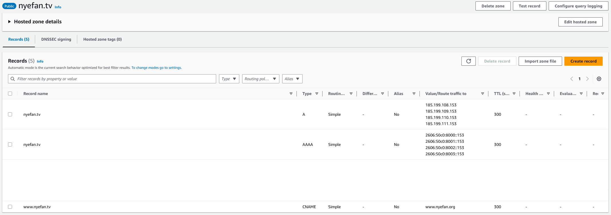

This repo exists solely to redirect https://nyefan.tv and https://www.nyefan.tv to https://www.nyefan.org while maintaining a valid certificate

## First create the resources in route53:

## Then configure GitHub Pages:

